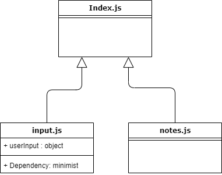

# LAB - 01 : Node Ecosystem

## Phase 1

### Author: Dina Alsaid

### Setup

#### `.env` requirements

#### Running the app

- `npm start` **note**: if it doesn't work use `node index.js --add ""`

#### Tests

- Unit Tests: `npm run test`
- Lint Tests: `npm run lint`

#### UML

(Created with [diagrams](https://app.diagrams.net/))

